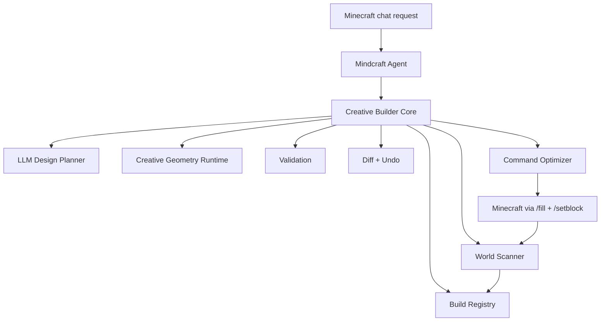
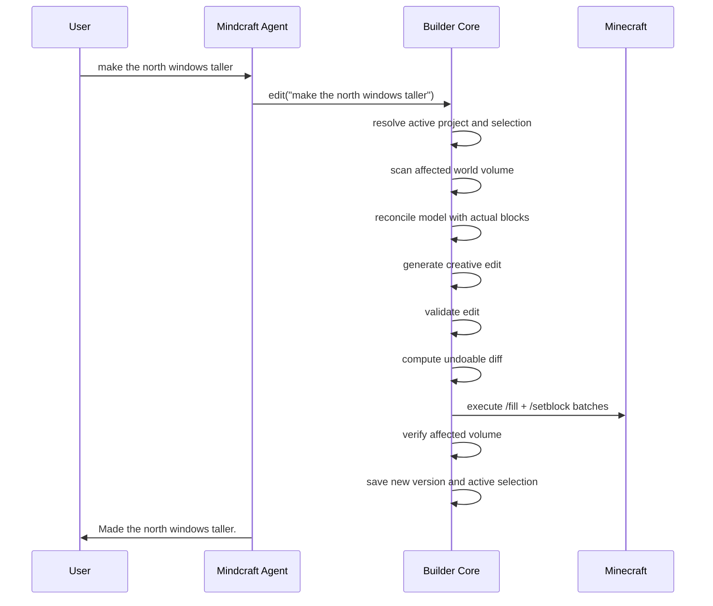

# Creative Builder Core Design

## Purpose

Mindcraft's current building path is useful for simple demos, but it is not strong enough for complex, beautiful structures that evolve through rapid user iteration. The current flow relies heavily on one-off LLM-generated JavaScript, chat history, and nearby world queries. That makes follow-up edits like "add windows on the north side", "make it bigger", or "add a hidden wine cellar" unreliable because the system does not maintain a durable semantic model of the build.

This design introduces a separate Creative Builder Core. Mindcraft remains the conversational Minecraft interface and command bridge. The builder core owns structure state, creative geometry generation, world scanning, diffing, command generation, undo, and verification.

The target workflow is creative-mode building with `/setblock` and `/fill`, optimized for immediate execution and fast iteration.

## Goals

- Build complex and beautiful Minecraft structures in creative mode.
- Let the agent make granular creative design decisions, including exact shapes, dimensions, placement, material palettes, and decorative details.
- Support live iterative editing: "change this", "make it larger", "add windows", "replace the trim with stone", "undo that".
- Preserve context across edits through a persistent build registry.
- Execute normal edits immediately without confirmation.
- Make every edit undoable.
- Scan and reconcile the actual Minecraft world before and after edits.
- Use `/fill` for large cuboids and `/setblock` for detail work.
- Keep low-level execution deterministic and reliable while leaving design and geometry creative.

## Non-Goals

- Survival-mode resource gathering, pathfinding, or physical block placement.
- Replacing Mindcraft's entire agent architecture.
- Forcing all builds through fixed templates that produce repetitive structures.
- Requiring user confirmation before every edit.
- Building a full visual editor in the first implementation.

## Architecture Overview



Mindcraft should delegate construction-oriented requests to the builder core instead of asking the general `!newAction` coding path to directly place blocks. The builder core returns a concise status message and the command batches needed to update the world.

## Core Design Principle

Creativity belongs in design and geometry generation. Reliability belongs in execution.

The LLM may creatively decide:

- architectural style
- dimensions and proportions
- exact placement
- shape of stairs, roofs, windows, towers, balconies, pools, hidden rooms, and decorative details
- material palettes
- asymmetry and variation
- semantic intent of each structure part

The deterministic builder core must own:

- persistence
- coordinate transforms
- block validation
- collision checks
- diff generation
- undo/redo
- `/fill` and `/setblock` batching
- world scanning
- verification and retries

The LLM should not emit raw Minecraft commands as the primary artifact. Raw commands are an output format generated from a validated voxel diff.

## Runtime Flow



Normal edits execute immediately. The system asks for confirmation only for destructive or global operations such as clearing a large region, deleting a whole project, replacing an entire structure, or editing outside a configured build area.

## Build Registry

The registry is the durable source of truth for builder-owned structures. It stores semantic parts and exact voxel state.

Example:

```json
{
  "activeProjectId": "project_001",
  "projects": {
    "project_001": {
      "name": "cliffside mansion",
      "origin": [120, 64, -30],
      "orientation": "north",
      "bounds": { "min": [100, 60, -50], "max": [150, 95, 10] },
      "activeSelection": {
        "targetId": "north_facade",
        "partIds": ["window_row_003"]
      },
      "parts": {
        "main_house": {
          "type": "structure",
          "name": "main house",
          "bounds": { "min": [110, 64, -40], "max": [140, 82, -10] },
          "children": ["north_facade", "roof", "interior"]
        },
        "north_facade": {
          "type": "facade",
          "normal": "north",
          "children": ["window_row_003", "trim_002"]
        },
        "window_row_003": {
          "type": "window_row",
          "style": "tall gothic arch",
          "materialPalette": {
            "frame": "stone_bricks",
            "glass": "gray_stained_glass_pane"
          }
        }
      },
      "versions": ["edit_001", "edit_002", "edit_003"]
    }
  }
}
```

The registry should be persisted as JSON initially. It can move to SQLite later if queries, indexing, or larger builds make JSON inconvenient.

## Working Set and Selection

Fast iteration depends on resolving references like "this", "that", "make it bigger", and "change those blocks to stone". The builder core maintains a working set:

- active project
- active structure
- active part
- last touched feature group
- recent edits
- current player/bot location
- optional pointing/selection context from Minecraft

Examples:

- After "add windows on the north side", the active selection becomes the new window row.
- "make them taller" applies to the active window row.
- "change the frames to stone" applies to the active window row's frame material.
- "undo that" reverses the last diff.
- "make the house wider" targets the active structure instead of the last window row because "house" is explicit.

When ambiguity remains, the system should make a reasonable choice and preserve undo rather than blocking the creative flow.

## Creative Geometry Runtime

The builder core should support two creative generation paths.

### Structured Design Specs

The LLM can emit high-level semantic edits:

```json
{
  "operation": "add_feature",
  "target": "main_house",
  "feature": {
    "type": "exterior_fire_escape",
    "attachSide": "east",
    "from": "roof",
    "to": "ground",
    "style": "industrial iron",
    "landings": "every_floor",
    "railings": true
  }
}
```

The builder core compiles these into exact blocks.

### Constrained Geometry DSL

For more expressive details, the LLM can generate geometry code in a constrained DSL. The DSL should expose voxel operations without allowing arbitrary filesystem, network, or process access.

Example concepts:

- `box`, `hollowBox`, `line`, `cylinder`, `sphere`, `arch`, `stairRun`, `spiral`, `roof`, `mask`
- transforms: `translate`, `rotate`, `mirror`, `scale`
- set operations: `union`, `subtract`, `intersect`
- block assignment by material palette
- semantic tagging of generated parts

For a helix stair, the LLM may define exact radius, height, turns, guardrail pattern, thickness, and material choices. The core validates the generated voxel plan before execution.

## Edit Operations

The initial operation set should cover rapid iteration:

- create project
- add structure
- add feature
- modify feature
- remove feature
- replace material
- scale or resize
- move
- rotate
- mirror
- restyle
- scan
- repair
- undo
- redo

Examples:

- "add windows on the north side"
- "make the windows taller"
- "change the trim to stone"
- "add a pool on the roof"
- "make the pool bigger"
- "add fire escape stairs from the roof to the ground"
- "add a wine cellar with a hidden entrance"
- "undo that"

## World Scanner and Reconciliation

Before each edit, the core scans the affected world volume. The scanner records actual blocks, compares them to the registry, and updates a reconciliation summary.

The scanner should detect:

- missing expected blocks
- extra unexpected blocks
- changed materials
- manually edited areas
- available free space
- exterior faces
- roof surfaces
- underground volume availability
- connected components

The first version can scan rectangular bounds around the active structure. Later versions can optimize scans by dirty regions and part bounds.

## Diff, Undo, and Versioning

Every edit produces a diff:

```json
{
  "editId": "edit_042",
  "summary": "made north facade windows taller",
  "targetPartIds": ["window_row_003"],
  "before": [
    { "pos": [118, 70, -40], "block": "oak_planks" }
  ],
  "after": [
    { "pos": [118, 70, -40], "block": "gray_stained_glass_pane" }
  ],
  "commands": [
    "/setblock 118 70 -40 gray_stained_glass_pane"
  ]
}
```

Undo applies the `before` side of the diff. Redo reapplies the `after` side. Diffs should be stored with enough metadata to restore both block state and semantic registry state.

## Command Optimizer

The command optimizer converts voxel diffs into Minecraft commands.

Rules:

- Use `/fill` for rectangular regions of the same block when this reduces command count.
- Use `/setblock` for individual detail blocks.
- Chunk very large edits to avoid command length or rate-limit issues.
- Preserve deterministic command ordering for repeatability.
- Support configurable command delay.
- Track command execution batches for retry and debugging.

The optimizer is an output layer. It does not own the design.

## Validation and Safety

Validation should happen before execution.

Checks:

- all block names are valid for the configured Minecraft version
- edit remains inside an allowed build area when configured
- generated geometry does not exceed command or size limits
- destructive edits are bounded
- feature references resolve to known parts or scanned regions
- generated voxel plan is non-empty
- hidden or underground features do not accidentally erase unrelated registered parts

Normal edits execute immediately. Confirmation is reserved for operations likely to destroy large user-visible work.

## Mindcraft Integration

Mindcraft should get a small integration surface rather than embedding all builder logic into the agent.

Candidate commands:

- `!build("request")`
- `!buildEdit("request")`
- `!buildUndo()`
- `!buildRedo()`
- `!buildScan()`
- `!buildStatus()`

The conversation prompt for a builder-focused profile should route structure requests through these commands, not through generic `!newAction`. The existing `!newAction` path can remain available for non-builder tasks, but it should not be the primary construction mechanism.

The builder core can initially run in-process as a local module. It should be designed so it can become a separate service later if preview rendering, heavier geometry processing, or multi-agent collaboration require that.

## Error Handling

The core should return concise user-facing messages and detailed logs.

Examples:

- If a block name is invalid, choose the closest valid block when obvious; otherwise report the issue.
- If an edit collides with an existing registered part, adapt around it when possible.
- If verification fails, retry the failed blocks once, then report exact remaining failures.
- If the world has drifted from the registry, reconcile first and continue unless the drift is destructive or ambiguous.
- If generated geometry is invalid, ask the design planner for a repair using the validation errors.

## Testing Strategy

Unit tests:

- registry persistence
- selection resolution
- block validation
- geometry primitives
- DSL sandbox behavior
- diff generation
- undo/redo
- `/fill` optimization
- command chunking

Integration tests:

- create structure, then add windows
- create structure, then resize it
- add roof pool
- add exterior fire escape
- add underground wine cellar
- undo and redo each operation
- reconcile after manual world edits

Verification tests can run against a fake world adapter first. A later test harness can use a real local Minecraft server.

## Phased Implementation

### Phase 1: Builder Core MVP

- Build registry JSON store.
- Active project and selection model.
- World adapter abstraction.
- Diff and undo/redo.
- `/setblock` and simple `/fill` command generation.
- Basic commands: build, edit, undo, redo, status.
- Material replacement and simple feature addition.

### Phase 2: Scanner and Verification

- Scan rectangular volumes.
- Reconcile registry with actual world blocks.
- Verify after command execution.
- Retry failed block placements.

### Phase 3: Creative Geometry

- Add structured design spec schema.
- Add constrained geometry DSL.
- Add primitives for walls, floors, roofs, windows, doors, stairs, pools, towers, and underground rooms.
- Add semantic tagging for generated parts.

### Phase 4: Rich Iteration

- Add operation planner for ambiguous live edits.
- Improve selection resolution.
- Add restyle operations.
- Add repair mode.
- Add schematic/export support.

### Phase 5: Preview and Tooling

- Optional 3D preview.
- Visual diff inspection.
- Build library and reusable style presets.

## Implementation Defaults

The first implementation should use these defaults:

- Preview is not required before normal edits. Undo is the primary safety mechanism for non-destructive changes.
- The first version supports one active project. Multiple named projects are a later extension.
- The first integration is through Minecraft chat commands. Dashboard integration is a later extension.
- The first creative geometry interface is a constrained declarative DSL. A sandboxed JavaScript escape hatch is a later extension after validation and diffing are reliable.

Confirmation is required only for destructive/global operations: clearing large regions, deleting a full project, replacing an entire structure, or editing outside a configured build area.

## Success Criteria

The first strong version succeeds if a user can build a house and then rapidly issue follow-up edits such as:

- "add windows on the north side"
- "make them taller"
- "change the frames to stone"
- "add a pool on the roof"
- "make the pool bigger"
- "add fire escape stairs down the outside"
- "add a wine cellar with a hidden entrance"
- "undo that"

Each edit should apply immediately, update persistent semantic state, preserve an undo point, and leave the actual Minecraft world verifiably consistent with the registry.
